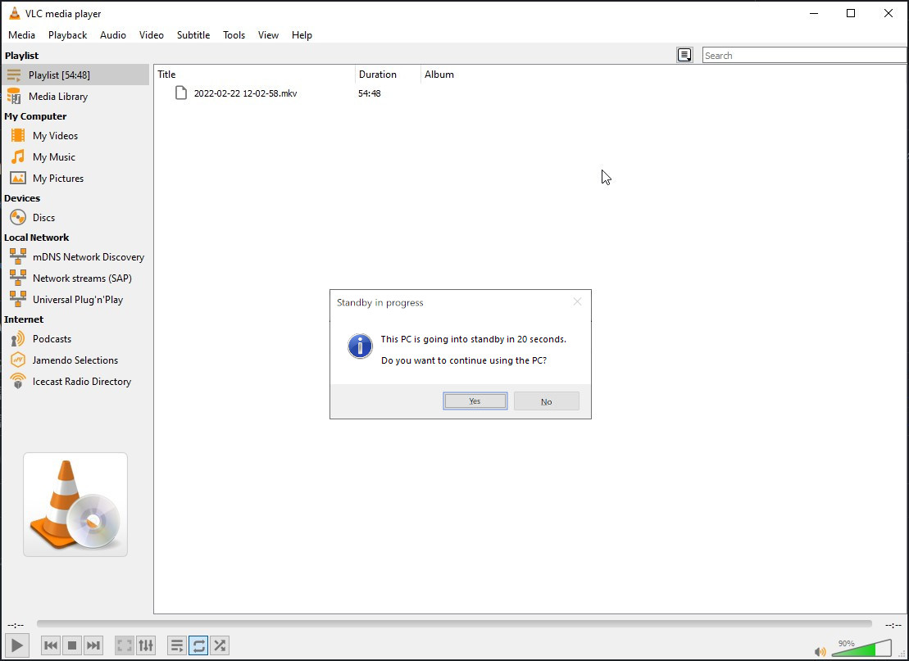

## VLC standby

The VLC Media Player does not have a built-in option to automatically standby the computer after the playlist ends.

This PowerShell script uses a watcher process to check when a movie is over/playlist is empty.

## Usage

Open a command prompt and run `powershell -ExecutionPolicy ByPass -File vlc-standby.ps1` and then start VLC.

Now each time your movie/playlist ends, a pop-up will show on your screen, warning you that your PC will go into standby in 20 seconds.

If you hit "Yes" you skip the standby. If you hit "No" it will go into standby immediately.

